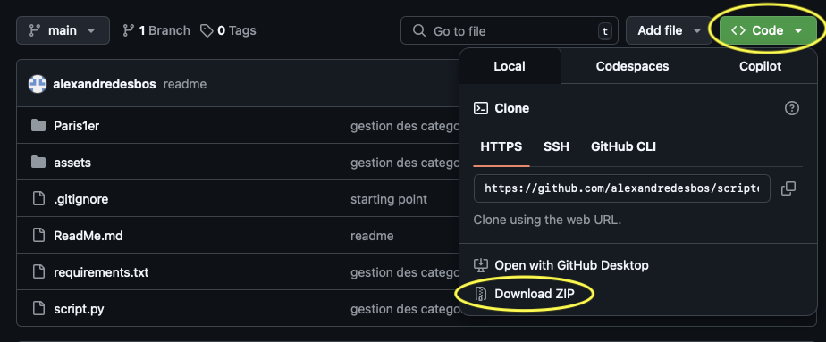

Pour executer le scipt:

Installe python si tu l'as pas: https://www.python.org/downloads/

Telecharge le dossier:


ouvre un terminal 

va dans le dossier scriptemail selon la ou tu l'as mis
```bash
cd Documents/scriptemail
```

A faire une seule fois:
```bash
python -m pip install --upgrade pip
python -m pip install -r requirements.txt
```

```bash
python3 script.py
```

Si tu as besoin d'arretter le script tu peux faire ctrl + c
